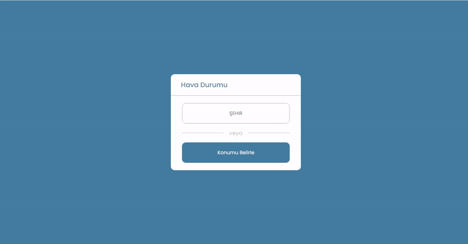

<h2> WEATHER APP </h2>

<h3> Used Techologies</h3>

<h4> HTML5 CSS3 JS API </h4>

 Small weather card was created. As a source, https://openweathermap.org/ was benefited to my repo. 
 

 Icons change according to weather events; clear, cloud, haze, rain, snow,storm

